<!DOCTYPE html>
<html lang="id">
<head>
    <meta charset="UTF-8">
    <meta name="viewport" content="width=device-width, initial-scale=1.0">
    <title>Jajanan Online - Seblak, Mie Jebew & Camilan Enak</title>
    
    <link href="https://fonts.googleapis.com/css2?family=Poppins:wght@300;400;500;600;700&display=swap" rel="stylesheet">
    <link rel="stylesheet" href="https://cdnjs.cloudflare.com/ajax/libs/font-awesome/5.15.3/css/all.min.css">
</head>
<body>
    <header>
        

            <h1>Jajanan Online</h1>
            
Seblak Pedas, Mie Jebew, & Camilan Enak Lainnya

        

    </header>
    
    <nav>
        

            <ul>
                <li><a href="#home">Beranda</a></li>
                <li><a href="#menu">Menu</a></li>
                <li><a href="#testimonials">Testimoni</a></li>
                <li><a href="#contact">Kontak</a></li>
            </ul>
        

    </nav>
    
    <section class="hero" id="home">
        

            <h1>Jajanan Online Enak & Pedasnya Nagih!</h1>
            
Temukan berbagai macam jajanan pedas dan minuman segar yang bikin ketagihan. Pesan sekarang dan nikmati di rumah!

            <a href="#menu" class="btn">Lihat Menu</a>
            <a href="#contact" class="btn btn-outline">Pesan Sekarang</a>
        

    </section>
    
    <section id="menu">
        

            

                <h2>Menu Andalan Kami</h2>
            

            
            

                <h2>Seblak Parasmanan</h2>
                
Bebas pilih toping sesuka hati <strong></strong>Rasanya gak bakal bikin kecewa ;)

                <a href="#contact" class="btn">Pesan Sekarang</a>
            

            
            <h3 style="text-align: center; margin-bottom: 2rem; font-size: 1.8rem; color: var(--dark);">Makanan Pedas</h3>
            

                

                    

                        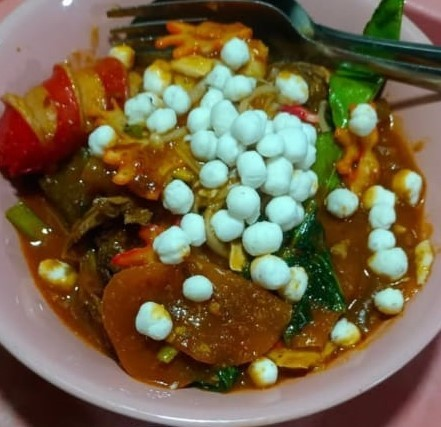
                    

                    

                        <h3>Seblak Kuah/Nyemek Parasmanan</h3>
                        
Kerupuk basah dengan bumbu khas, bisa pilih level pedas 0-5

                        
mulai dari Rp10.000

                    

                

                
                

                    

                        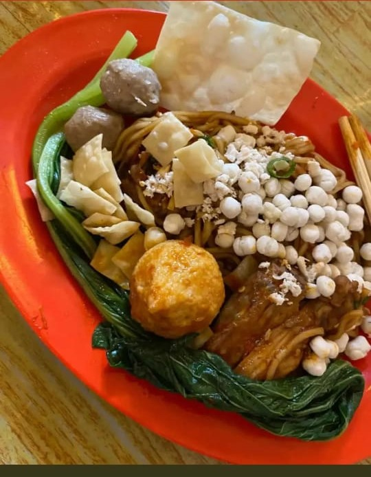
                    

                    

                        <h3>Mie Jebew</h3>
                        
Mie kenyal dengan bumbu pedas level 0-5, bikin nagih!

                        
Rp10.000

                    

                

                
                

                    

                        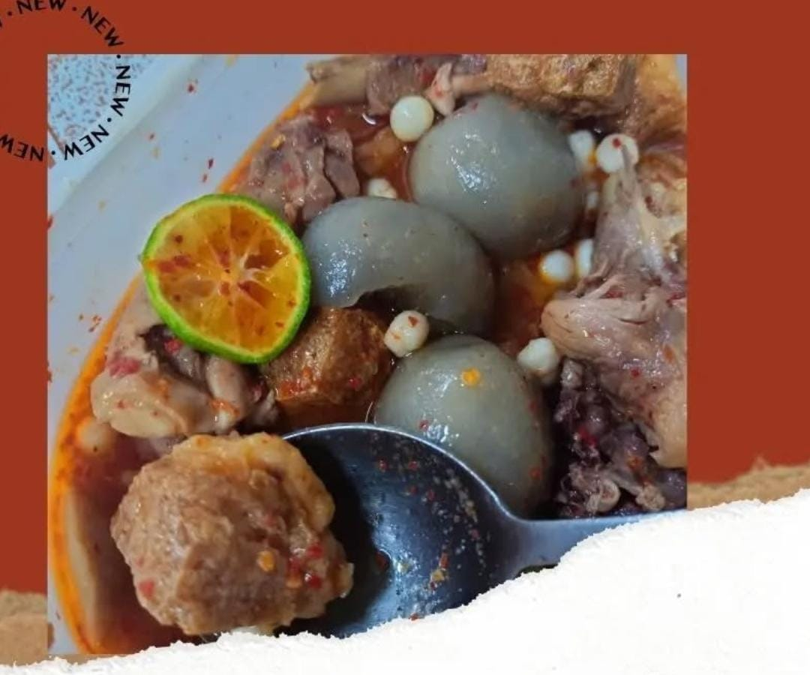
                    

                    

                        <h3>Baso Aci</h3>
                        
Baso kenyal dengan kuah gurih, bisa ditambah level pedas

                        
Rp10.000

                    

                

                
                

                    

                        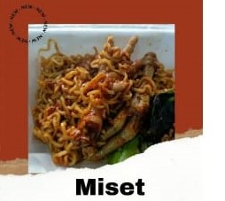
                    

                    

                        <h3>Miset</h3>
                        
Misetnya gurih, pedas, maknyos

                        
Rp10.000

                    

                

            

            
            <h3 style="text-align: center; margin: 3rem 0 2rem; font-size: 1.8rem; color: var(--dark);">Camilan & Minuman</h3>
            

                

                    

                        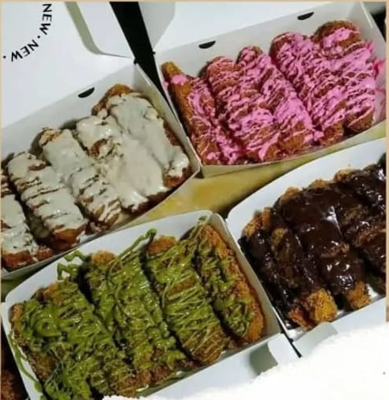
                    

                    

                        <h3>Banana Crispy</h3>
                        
Pisang goreng tepung krispi, manis & lembut dalam

                        
Rp10.000

                    

                

                
                

                    

                        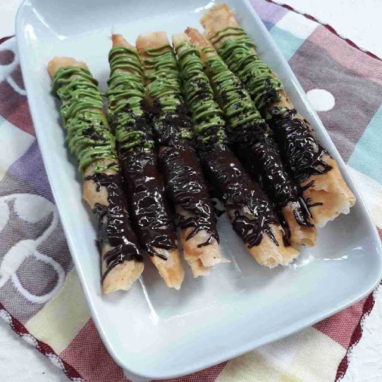
                    

                    

                        <h3>Banana Roll</h3>
                        
Pisang dibalut kulit lumpia, digoreng sampai golden brown

                        
Rp10.000

                    

                

                
                

                    

                        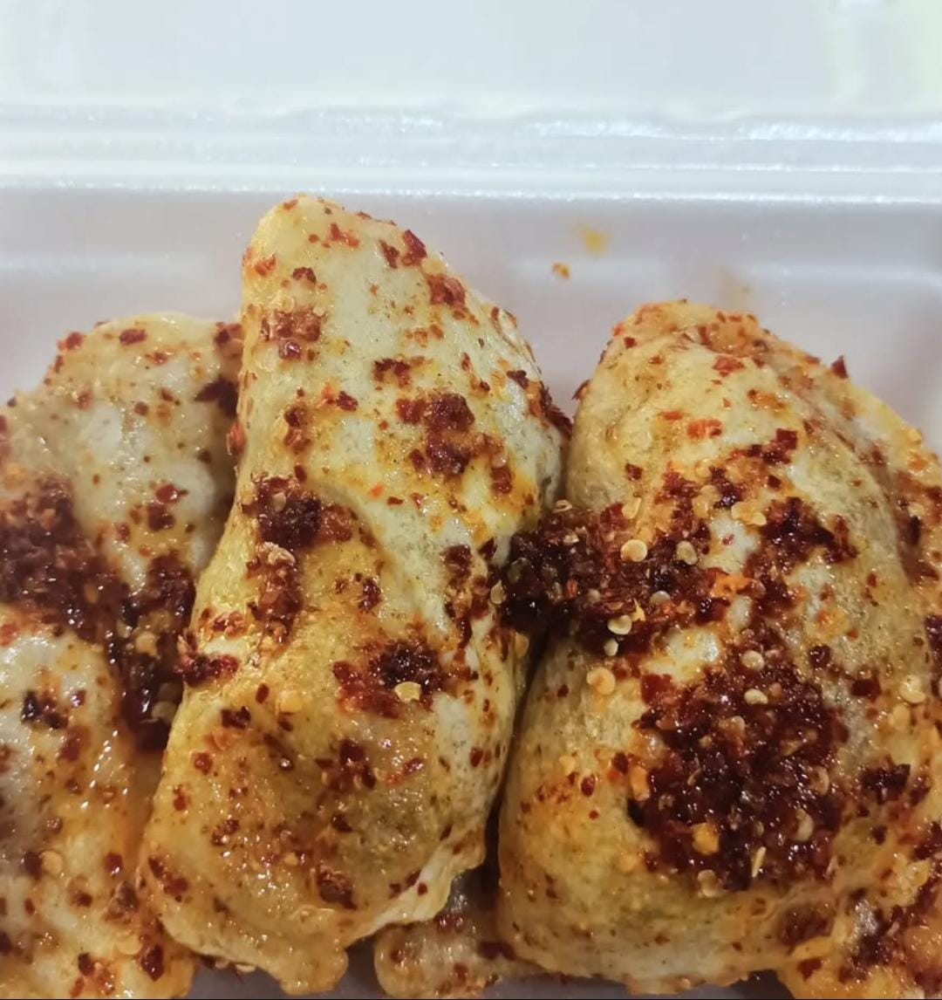
                    

                    

                        <h3>Cireng Rasa Ayam atau usus</h3>
                        
Cireng isi ayam enak banget buat ngemil

                        
Rp1.000/pcs

                    

                

                
                

                    

                        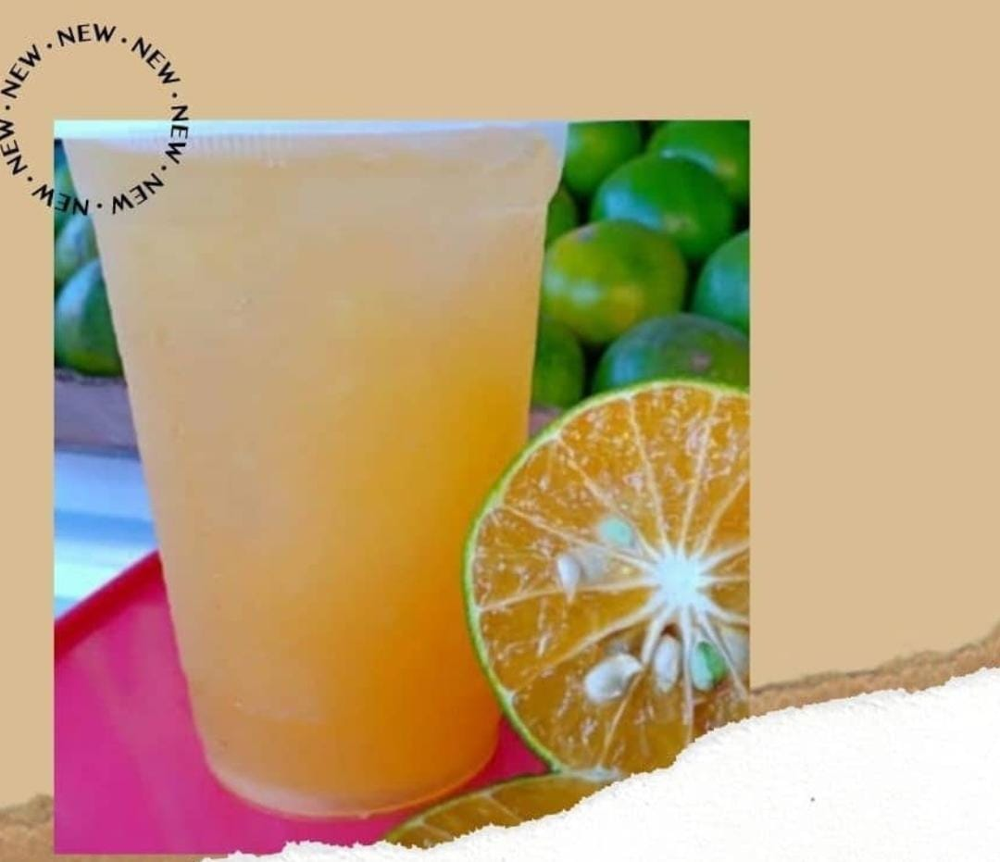
                    

                    

                        <h3>Es Jeruk Peras</h3>
                        
Segar alami, bikin melek! Cocok teman makanan pedas

                        
Rp5.000

                    

                

                
                

                    

                        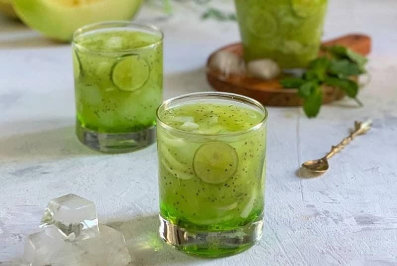
                    

                    

                        <h3>Es Kuwut</h3>
                        
Kelapa muda + sirup, pelepas dahaga terbaik

                        
Rp.7000

                    

                

                
                

                    

                        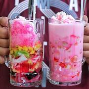
                    

                    

                        <h3>Es Campur & Sop Buah</h3>
                        
Mix buah segar dengan sirup & susu, manisnya pas

                        
Rp7.000 - Rp10.000

                    

                

            

        

    </section>
    
    <section class="testimonials" id="testimonials">
        

            

                <h2>Apa Kata Pelanggan Kami?</h2>
            

            
            

                

                    

                        
"Seblak level 3 nya pas banget pedasnya! Nagih banget, udah pesen berkali-kali. Baso Acinya juga enak, kuahnya gurih."

                    

                    

                        
                        

                            <h4>Desti R</h4>
                            
Pelanggan Setia

                        

                    

                

                
                

                    

                        
"Mie Jebew level 5 beneran nendang! Cocok buat pecinta pedas ekstrim. Banana Rollnya juga enak, manisnya pas."

                    

                    

                        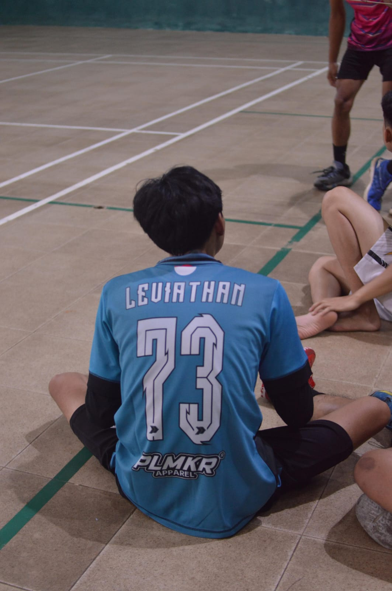
                        

                            <h4>Shofil F</h4>
                            
Pecinta Pedas

                        

                    

                

                
                

                    

                        
"Pesen Es Kuwut sama Basreng Bojot buat teman ngerjain tugas, enak banget! Pengirimannya juga cepat. Recommended!"

                    

                    

                        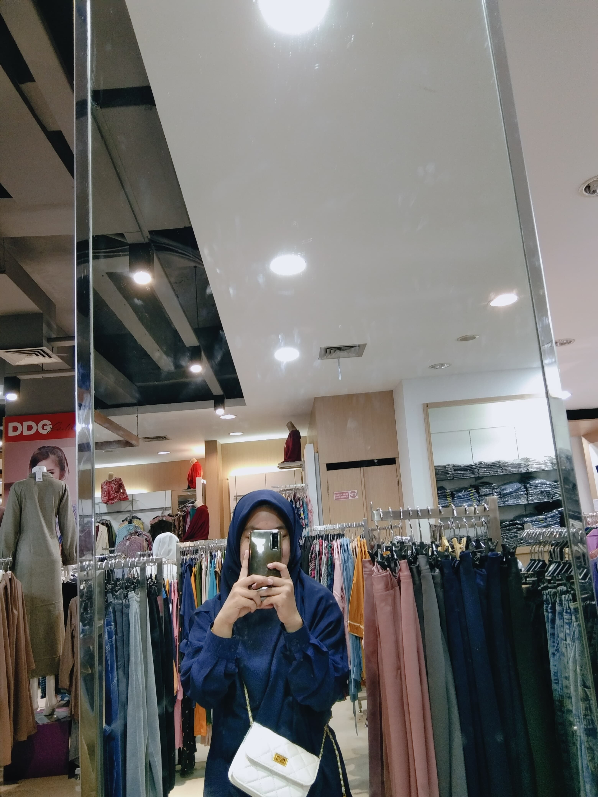
                        

                            <h4>Meli A</h4>
                            
Mahasiswa

                        

                    

                

            

        

    </section>
    
    <section class="contact" id="contact">
        

            

                <h2>Pesan Sekarang</h2>
            

            
            

                

                    <h3>Hubungi Kami</h3>
                    
<i class="fas fa-map-marker-alt"></i> Jl.Bantarpayung,Cibalong, Tasikmalaya

                    
<i class="fas fa-phone"></i> +62 838-4884-7331

                    
<i class="fas fa-envelope"></i> jajananonline@gmail.com

                    
<i class="fas fa-clock"></i> Buka setiap hari 11.00 - 21.00 WIB

                    
                    

                        <a href="https://wa.me/083848847331"><i class="fab fa-whatsapp"></i></a>
                        <a href="#"><i class="fab fa-instagram"></i></a>
                        <a href="#"><i class="fab fa-facebook-f"></i></a>
                    

                

                
                

                    <form id="orderForm">
                        <input type="text" name="nama" placeholder="Nama Anda" required>
                        <input type="tel" name="whatsapp" placeholder="Nomor WhatsApp" required>
                        <textarea name="pesanan" placeholder="Pesanan Anda (Contoh: 1 Seblak Level 3, 2 Mie Jebew Level 2, 1 Es Jeruk Peras)" required></textarea>
                        <textarea name="alamat" placeholder="Alamat Pengiriman (Jika delivery)" required></textarea>
                        <textarea name="catatan" placeholder="Catatan Tambahan (Level pedas, dll)"></textarea>
                        <button type="submit" class="btn">Kirim Pesanan via WhatsApp</button>
                    </form>
                

            

        

    </section>
    
    <footer>
        

            

                <h3>Jajanan Online</h3>
                
Seblak Pedas, Mie Jebew, & Camilan Enak Lainnya

                
                <ul class="footer-links">
                    <li><a href="#home">Beranda</a></li>
                    <li><a href="#menu">Menu</a></li>
                    <li><a href="#testimonials">Testimoni</a></li>
                    <li><a href="#contact">Kontak</a></li>
                </ul>
                
                
© 2025 Jajanan Online

            

        

    </footer>
    
    
</body>
</html>
